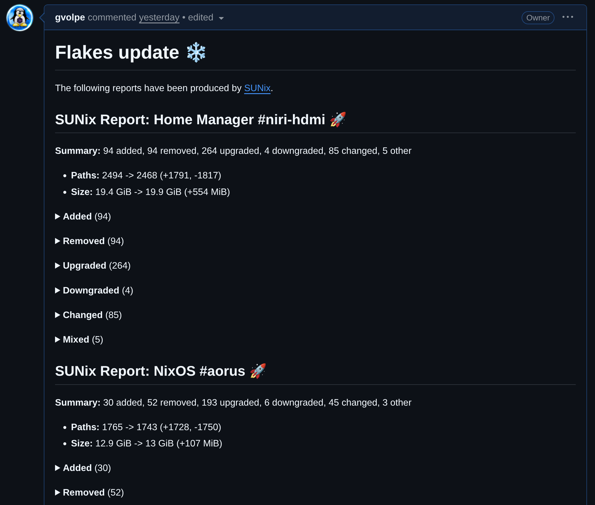

This blogpost would have been too short if I only talked about a single topic, so I decided to combine both topics into a single post, as both qualify as actual Quality Of Service (QoS) improvements to my workflows.

## SUNix: Software Updates for Nix

[SUNix](https://github.com/gvolpe/sunix) is a recent project I worked on that provides a feature many standard Linux distros ship with: **"Available Software Updates"**. Ever wanted to know what packages would be upgraded or removed with the next `nixpkgs` upgrade without switching yet?

The following video showcases the first version `0.1.0`.



### Diff Reports

Furthermore, the newer version `0.2.0` ships with a new feature: **PDF and Markdown reports**. I was too lazy to record another video just to show that, but you can get a pretty good idea by looking at the Markdown reports generated for [this Pull Request](https://github.com/gvolpe/nix-config/pull/334).



These reports can be generated directly from the UI or via the CLI, e.g.

```console
nix build --print-out-paths --no-link \
  .#nixosConfigurations.<your_flake>.config.system.build.toplevel \
  | xargs dix /run/current-system/ \
  | sunix --markdown-report "NixOS .#<your_flake>"
```

And the PDF reports are very pretty as well 🤩, but that's just a bonus.

## Dots: the HM module you didn't know you needed

This is a quick follow-up post from [Home Manager: dotfiles management](../home-manager-dotfiles-management), written a while ago now. In the last part of this old post, I've introduced a `dotfiles` Home Manager module, which was on the right track. 

However, each module that needed to handle mutable configuration files looked something like this:

```nix
{ pkgs, lib, config, ... }:

let
  filePath = "${config.dotfiles.path}/programs/neofetch/electric.conf";
  configSrc =
    if !config.dotfiles.mutable then ./electric.conf
    else config.lib.file.mkOutOfStoreSymlink filePath;
in
{
  home.packages = [ pkgs.neofetch ];
  xdg.configFile."neofetch/config.conf".source = configSrc;
}
```

The `mkOutOfStoreSymlink` function was leaking everywhere, so I've come up with a better implementation of the `dotfiles` module ever since. To give you an idea on the current looks, the equivalent would now be this (if I still used `neofetch`):

```nix
{ pkgs, config, ... }:

{
  home.packages = [ pkgs.neofetch ];
  xdg.configFile."neofetch/config.conf".source =
    config.dotfiles.make ./electric.conf;
}
```

Neat! Isn't it? The `dotfiles.make` function encapsulates all the symlinking logic now.

This newly improved module lives now under the [dots](https://github.com/gvolpe/dots) repo, and everyone can benefit from it. All you have to do is import the module (see instructions in the **README** file) and set the following options:

```nix
{ config, ... }:

{
  dotfiles = {
    mutable = true;
    path = "${config.home.homeDirectory}/workspace/nix-config/home";
    sourceRoot = ./.;
  };
}
```

The module has good test coverage, and the documentation explains these options in detail if you'd like to learn more.

### Why mutability?

An essential part of my workflows is the ability to tinker with configuration files freely without `home-manager switch` getting in the way of experimenting --- like adding keybindings to my Niri configuration or adjusting the blur levels of certain layers.

At the same time, I don't want to give up the reproducibility and portability that immutable configuration files give me. For instance, I could share my Neovim wrapper and anyone could run the same exact version with all the plugins and keybindings I set up.

The `dotfiles` module gives us the best of both worlds with none of the fuzz.

## Final thoughts

These little two projects have brought me much joy recently, so I hope you enjoy them too!

Best,
Gabriel.
