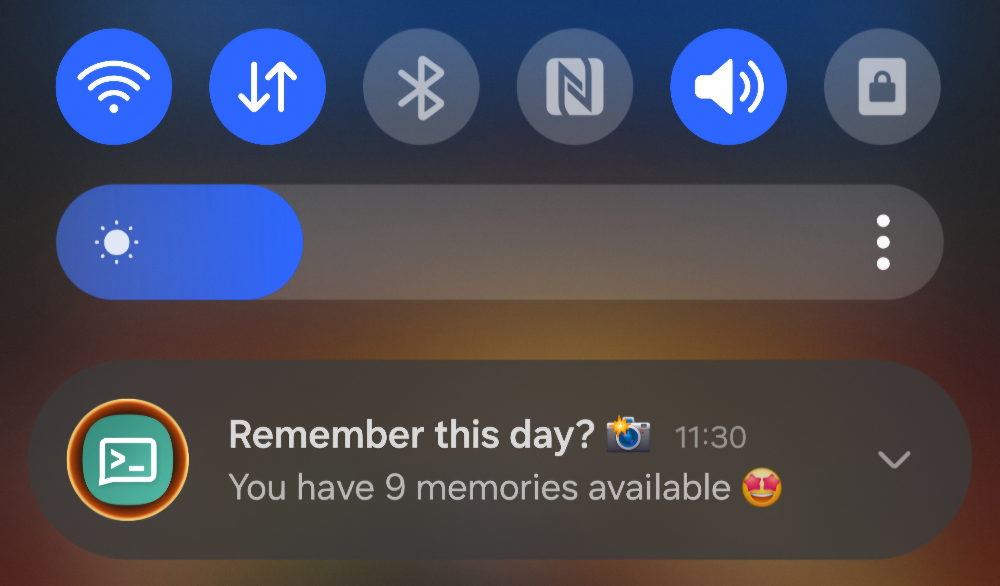
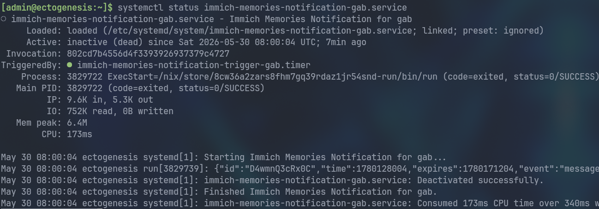
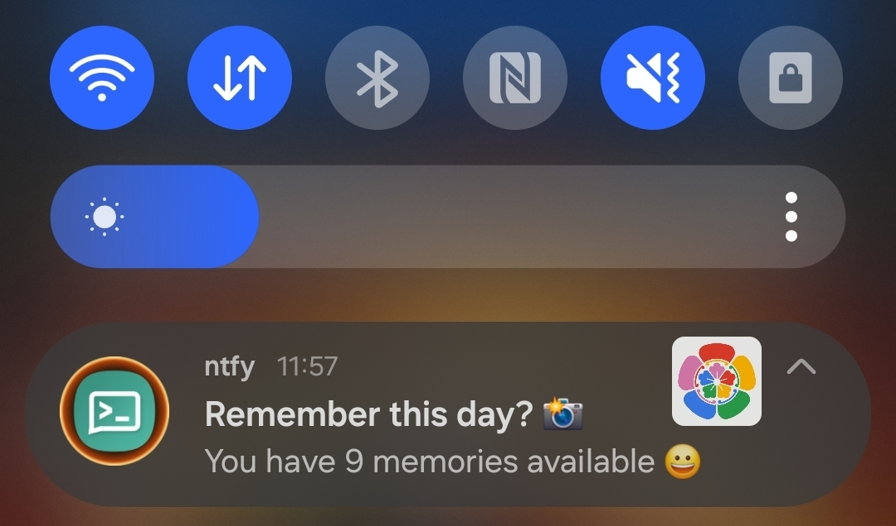
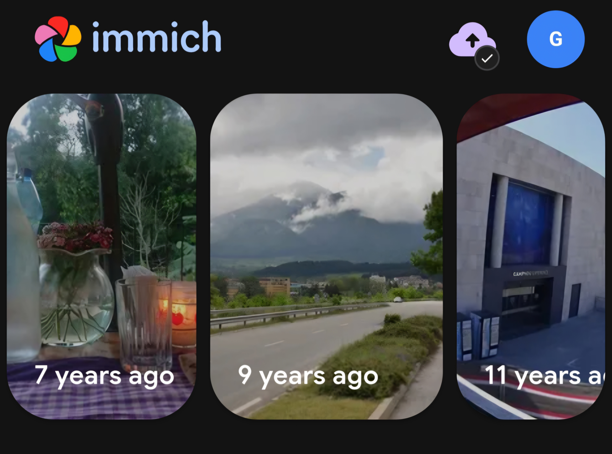

One of the most beloved features [Immich](../immich-photos) offers (also Google Photos) is *memories*. It temporarily transports us back in time to cherish our old precious photos and videos once again. However, we need to remember to open the app on a daily basis to do so --- there's no baked in notification system that would remind us.

This is another [heavily-requested feature](https://github.com/immich-app/immich/discussions/3981), and if you check out that discussion, you'll find a couple of vibe-coded solutions like [this python script](https://github.com/james-maschal/Immich-Memories-Notification) or [this dockerized application](https://github.com/ismaildakrory/immich-memories-notify). None of them felt right to me, though.

So after living without this feature for the past few months, I finally found the time and energy to tackle the issue, and I'd like to share a custom solution that ensures we are reminded to check on our memories 👇


*Sneak peek of a custom Android push notification 🤖*

Does this pick your interest? Keep on reading :)

## Memories

Notifications must support multiple users in my case, so I've created NixOS module that can be used as follows.

```nix
{
  notifications.immich-memories = {
    enable = true;
    domain = "immich.app";
    users = {
      gab = {
        apiKey = "immich-memories-api-key";
        ntfy.topic = "immich";
        schedule = "*-*-* 08:00:00";
      };
    };
  };
}
```

The premise is simple enough if we look at the main script implementation.

```nix
let
  cfg = config.notifications.immich-memories;

  script = userCfg: pkgs.writeShellApplication {
    name = "run";
    runtimeInputs = with pkgs; [ coreutils curl jq ];
    text = ''
      IMMICH_API_KEY=$(cat /run/agenix/${userCfg.apiKey} | tr -d '\n')
      NTFY_API_TOKEN=$(cat /run/agenix/${userCfg.ntfy.token} | tr -d '\n')

      TODAY=$(date +"%Y-%m-%d")

      MEMORIES=$(curl -s \
        -H "x-api-key:$IMMICH_API_KEY" \
        -H "Content-Type: application/json" \
        "https://${cfg.domain}/api/memories/statistics?for=$TODAY" | jq .total)

      if [ "''${MEMORIES:-0}" -ge 1 ]; then
        curl -s \
          -H "Title: Remember this day? 📸" \
          -H "Click: immich://open" \
          -H "Authorization: Bearer $NTFY_API_TOKEN" \
          -d "You have $MEMORIES memories available 🤩" \
          ${config.services.ntfy-sh.settings.base-url}/${userCfg.ntfy.topic}
      fi
    '';
  };
in { }
```

It queries the [Immich Memories API](https://api.immich.app/endpoints/memories) to check whether we have any memories available (it requires an API key with `memory.statistics` permissions), and if that's the case, it sends a push notification via the [ntfy-sh](https://github.com/binwiederhier/ntfy) service.

This job is then triggered on a daily basis via standard systemd timers.

```nix
{
  config = lib.mkIf (cfg.enable && config.services.ntfy-sh.enable) {
    systemd = lib.concatMapAttrs
      (name: userCfg: {
        services."immich-memories-notification-${name}" = {
          description = "Immich Memories Notification for ${name}";
          after = [ "ntfy-sh.service" ];
          serviceConfig = {
            Type = "oneshot";
            ExecStart = "${script userCfg}/bin/run";
          };
        };

        timers."immich-memories-notification-trigger-${name}" = {
          description = "Run Immich Memories Notification check daily for ${name}";
          timerConfig = {
            OnCalendar = userCfg.schedule;
            Unit = "immich-memories-notification-${name}.service";
          };
          wantedBy = [ "timers.target" ];
        };
      })
      cfg.users;
  };
}
```

The `cfg.users` attrset comes from the aforementioned custom NixOS module, shown below.

```nix
{
  options.notifications.immich-memories = {
    enable = lib.mkEnableOption "Enable Immich memories notifications";

    domain = lib.mkOption {
      description = "The domain on which immich is hosted";
      type = lib.types.str;
    };

    users = lib.mkOption {
      type = lib.types.attrsOf (
        lib.types.submodule (
          { ... }:
          {
            options = {
              apiKey = lib.mkOption {
                description = "The immich api key secret to be looked up under /run/agenix/";
                type = lib.types.str;
              };
              ntfy = {
                token = lib.mkOption {
                  description = "The ntfy api token secret to be looked up under /run/agenix/";
                  default = "ntfy-api-token";
                  type = lib.types.str;
                };

                topic = lib.mkOption {
                  description = "The ntfy topic to send the push notification to";
                  type = lib.types.str;
                };
              };
              schedule = lib.mkOption {
                description = "The calendar time when the job needs to run (default at 8 am)";
                default = "*-*-* 08:00:00";
                type = lib.types.str;
              };
            };
          }
        ));
    };
  };
}
```

The following screenshot shows the systemd service being triggered for username `gab` at 8 am UTC.



Did I ever mention I love NixOS? 🤩

### Notification service

Testing can be done quickly via the freely available [ntfy-sh](https://ntfy.sh/) service. However, for real-world use you should consider self-hosting with the service behind a reverse proxy, which can't be any easier with NixOS.

```nix
{ config, ... }:

let
  cfg = config.services.ntfy-sh.settings;
  domain = "your-custom-domain.com";
in
{
  systemd.services.ntfy-sh.serviceConfig = {
    CacheDirectory = "ntfy-sh";
    StateDirectory = "ntfy-sh";
  };

  services = {
    ntfy-sh = {
      enable = true;
      environmentFile = "/run/agenix/ntfy-env";
      settings = {
        listen-http = "127.0.0.1:8080";
        base-url = "https://${domain}";
        behind-proxy = true;
        # cache
        attachment-cache-dir = "/var/cache/ntfy-sh/attachments";
        cache-file = "/var/cache/ntfy-sh/cache.db";
        # authentication
        auth-file = "/var/lib/ntfy-sh/auth.db";
        auth-default-access = "deny-all";
        # web ui auth
        enable-login = true;
        require-login = true;
      };
    };

    nginx = {
      enable = true;
      virtualHosts.${domain} = {
        forceSSL = true;
        enableACME = true;
        locations."/" = {
          proxyPass = "http://${cfg.listen-http}";
          proxyWebsockets = true;
        };
      };
    };
  };
}
```

The `environmentFile` option is perhaps the most relevant here; it is where we declare our admin user and available access tokens. It looks as follows (then encrypted via [agenix](https://github.com/ryantm/agenix)):

```ini
NTFY_AUTH_USERS='myuser:$2b$10$HY51Myw1T/tOV6dQHFJak.7P5JohyXXojxVqt4.PQMDjEZIeAb8MC:admin'
NTFY_AUTH_TOKENS='myuser:tk_8zqjy8boky0s1kogjggdq35ej0ff1'
```

You can try their [config generator](https://docs.ntfy.sh/config/#config-generator) or use the `ntfy` client to get these values.

### Mobile notification

We've seen a sneak peek of the push notification, but know it's also possible to specify the icon, e.g. [Immich Icon](https://raw.githubusercontent.com/immich-app/immich/refs/heads/main/mobile/android/fastlane/metadata/android/en-US/images/icon.png).



The most important part is that when we tap on it, it opens the Immich App.



Now it took me some time to figure out the exact command to get this working as intended.

```nix
curl -s \
  -H "Title: Remember this day? 📸" \
  -H "Click: immich://open" \
  -H "Authorization: Bearer $NTFY_API_TOKEN" \
  -d "You have $MEMORIES memories available 🤩" \
  ${cfg.settings.base-url}/immich
```

The key was using `immich://open`, which leverages their custom URL scheme defined both for [Android](https://github.com/immich-app/immich/blob/26714f6bfe70db9b8ec776fa8897c16181eb59b1/mobile/android/app/src/main/AndroidManifest.xml#L97) and [iOS](https://github.com/immich-app/immich/blob/a838167f110deaa6c7c7c2361e01287f05219bfa/mobile/ios/Runner/Info.plist#L103).

## Closing remarks

Immich has been great so far! I hope someone finds this little trick useful to enhance the overall experience.


My subscription has now come to an end — I previously thought it was end of August, but it turns out it was end of May. I deleted about 300 GBs worth of media and uninstalled the app from my phone for good. It felt scary and liberating at the same time 🐎



Closing out this post by sharing a special memory from my home country --- [time flies](https://www.youtube.com/watch?v=UkJBS0Zazmw) 🥹


*Snap from a 2016 ice trekking on Perito Moreno Glacier, Argentina 🇦🇷*

Best,
Gabriel.
