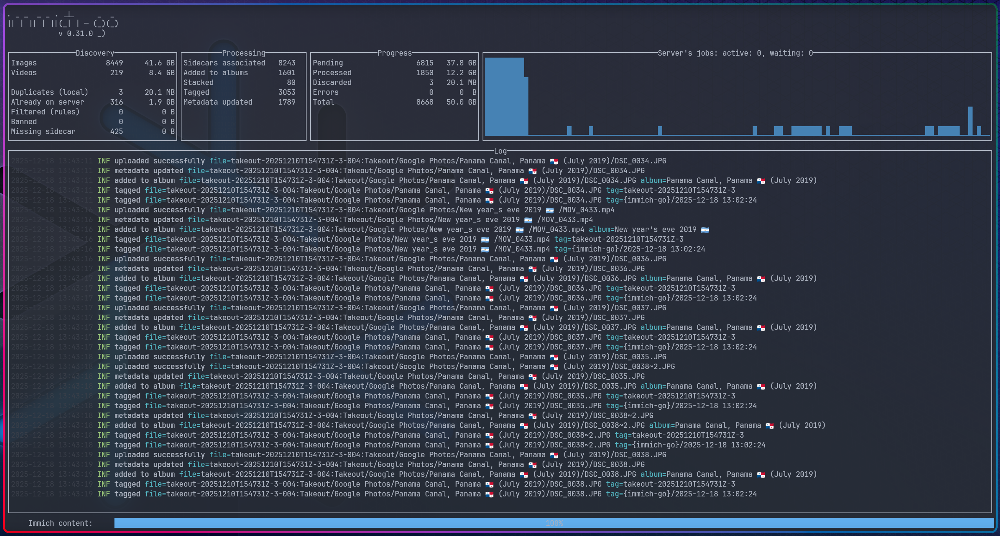
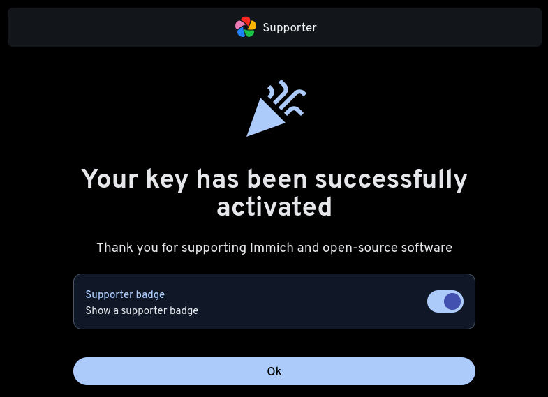

As someone who loves going for adventures abroad, the [memories](https://gvolpe.com/classy-lens) I've captured behind the lens have become extremely valuable to me. I've learned to appreciate that I can still cherish those memories many years later, regardless of whether the source was a DSLR, a smartphone, or a GoPro. The feelings these precious memories rekindle are priceless; as a tech person, it's only reasonable to seek out a 'safe haven' for them.


*Snap from a 2020 mid-summer hike in Torres Del Paine, Chile 🇨🇱*

Up until now, that place was Google Photos. As much as that hurt the privacy-freak in me, I have come to accept that for a very long time, there was no real competition. However, the landscape has changed drastically in recent years. Privacy-focused and open-source solutions like [Ente](https://ente.io/) and [Immich](https://immich.app/) have entered the space (among [many others](https://meichthys.github.io/foss_photo_libraries/)), offering viable alternatives for those looking to reclaim their data.

**Ente** is impressive on paper. They offer *end-to-end encryption* and *three copies of your data spread across three different countries* --- including an [underground fallout shelter in France](https://ente.io/help/photos/faq/security-and-privacy#data-storage-location). While it’s possible to self-host Ente (especially with the help of [NixOS](https://search.nixos.org/options?channel=unstable&query=services.ente)), the service is primarily designed around its excellent paid cloud plans.

**Immich**, on the other hand, is built from the ground up for self-hosting. While they [may be working](https://docs.immich.app/FAQ/#are-you-open-to-commercial-partnerships-and-collaborations) on a cloud offering, the current focus is on giving users total control over their deployment environment. The good news is that it's incredibly easy to spin up a production-ready Immich instance via the [NixOS](https://search.nixos.org/options?channel=unstable&query=services.immich) module.

After running both for a while, I found myself leaning toward Immich; its UI/UX feels much more polished, and it resembles the Google Photos experience so closely that the transition felt almost seamless.

The ultimate deciding factor, however, was the migration. When you have hundreds of gigabytes on the line, the import process needs to be bulletproof. [Immich-go](https://github.com/simulot/immich-go) handled my rather big Google Takeout library with ease, whereas my experience with Ente’s migration tool was a bit [unfortunate](https://github.com/ente-io/ente/issues/8259).

Ready to dive into the full journey of self-hosting Immich? Buckle up! 🛠️

## Immich

We'll begin with the easiest piece of the puzzle: getting Immich up and running behind an Nginx proxy on NixOS. 

```nix
{ ... }:

let
  host = "immich-domain.org";
  port = 2283;
in
{
  systemd.tmpfiles.rules = [
    "d /var/cache/immich/matplotlib 0700 immich immich -"
  ];

  services = {
    immich = {
      inherit port;
      enable = true;
      accelerationDevices = [ ];
      database = {
        enable = true;
        enableVectors = true;
        enableVectorChord = true;
        createDB = true;
      };
      machine-learning = {
        enable = true;
        environment.MPLCONFIGDIR = "/var/cache/immich/matplotlib";
      };
      mediaLocation = "/var/lib/immich";
      openFirewall = false;
      redis.enable = true;
      # settings can be set directly in the UI
      settings = null;
    };

    nginx = {
      enable = true;
      clientMaxBodySize = "500M";
      virtualHosts."${host}" = {
        forceSSL = true;
        enableACME = true;
        locations = {
          "/" = {
            proxyPass = "http://localhost:${toString port}";
            proxyWebsockets = true;
          };
        };
      };
    };
  };
}
```

That's pretty much all it takes. However, we're still a long way off from reaching a final verdict, as setting up a reliable storage system requires some heavy lifting.

### Storage

Immich stores media files in a regular Unix-compatible file system (EXT4, ZFS, APFS, etc.). Ente, on the other hand, uses S3 object storage. This was a huge point in favor of Ente, making it even harder to make a decision.

The main advantage of using S3 object storage is that it's so much cheaper than raw disk space in cloud services. Immich native S3 support is a [heavily requested feature](https://github.com/immich-app/immich/discussions/23745), so hopefully it becomes a reality some day.

To circumvent this issue, I decided to go down the rabbit hole and implement the most technically challenging solution: setting up [S3QL](https://github.com/s3ql/s3ql) as the file system, because why not? 😁


"S3QL is a file system that stores all its data online using storage services like Google Storage, Amazon S3, or OpenStack. It provides a virtual drive of dynamic, infinite capacity that can be accessed from any computer with internet access. S3QL is a full featured UNIX file system that is conceptually indistinguishable from a local file system like ext4. Furthermore, S3QL has additional features like compression encryption, data de-duplication, immutable trees and snapshotting which make it especially suitable for online backup and archival."


S3QL requires our storage provider to support "immediate consistency" to [avoid data loss](https://www.rath.org/s3ql-docs/durability.html), as some providers only offer eventual consistency. However, since all my NixOS virtual machines run on Hetzner and they offer [S3-compatible object storage](https://docs.hetzner.com/storage/object-storage/overview/) with these guarantees (i.e. they run a [Ceph](https://ceph.io/en/) cluster) at good prices, it was a no-brainer.


The main media storage is located in Finland, which falls under the `eu-central` network zone, whereas the replica bucket is located in Germany, which shares the same network zone.


"Internal traffic within the same network zone is free of charge. See <a href="https://docs.hetzner.com/storage/object-storage/overview#pricing" target="_blank">Pricing</a> details."


This is a *crucial factor*, as it means we can replicate all our data from Finland over to Germany (pretty much) for free!

Another key element is *proximity* between the compute instance (Immich server) and the S3 bucket --- i.e. they should be in the same location to reduce latency. Since S3QL is a FUSE-based file system, every I/O request travels from the kernel to user-space and then over the network; even minor latency jitter and routing resets can disrupt the mount.

During an Immich startup, the application performs thousands of `stat()` and `read()` file system calls. If S3QL is simultaneously flushing metadata or processing deletes, even a 100ms lag spike can lead to `NoSuchBucket` errors, causing the mount to panic and crash.

For this reason, both the Immich server and the main S3 bucket are located in the same datacenter in Helsinki.

## S3QL file system

Managing the S3QL file system is possibly the most challenging part. It took me multiple attempts to ensure a reproducible approach that can survive restarts and can be replicated on a brand new machine. 

After much trial and error, I came up with a [custom NixOS module](https://github.com/gvolpe/s3ql.nix) that sets up a few [systemd](https://systemd.io/) services that are responsible for managing the intricacies of mounting such a file system, so that it can be easily used.

```nix
{ ... }:

{
  services.s3ql = {
    enable = true;

    settings = {
      bucket = {
        url = "s3c://hel1.your-objectstorage.com/source-bucket/s3ql";
        name = "hzfi";
      };
      cache = {
        directory = "/mnt/s3ql-cache/.s3ql";
        size = 30000000; # 30 GBs
      };
      mountpoint = "/mnt/s3ql";
      skipMkfs = false;
    };
  };
}
```

Behind the scenes, a few things are happening. First of all, it defines a *.mount* unit that encodes information about a file system mount point controlled and supervised by systemd.

```nix
{ config, ... }:

let
  cfg = config.services.s3ql;
in
{
  systemd.tmpfiles.rules = [
    "d ${cfg.settings.mountpoint} 0755 root root -"
  ];

  systemd.mounts = [
    {
      name = cfg.settings.mountUnitName;
      requires = [ "s3ql-mount.service" ];
      after = [ "s3ql-mount.service" ];
      where = cfg.settings.mountpoint;
      what = cfg.settings.bucket.url;
      type = "none"; # the mounting is done by the service
      wantedBy = [ "multi-user.target" ];
    }
  ];
}
```

Which sets up the requirements for the next three systemd services: `s3ql-auth`, `s3ql-fs` and `s3ql-mount`.

```nix
{ config, pkgs, ... }:

let
  cfg = config.services.s3ql;
  authService = "s3ql-auth.service";
  fsService = "s3ql-fs.service";
in
{
  systemd.services = {
    s3ql-auth = {
      description = "s3ql authfile setup";
      serviceConfig = {
        Type = "oneshot";
        RemainAfterExit = true;
        User = "root";
        Group = "root";
        ExecStart = "${authScript}/bin/run";
      };
    };

    s3ql-fs = {
      description = "s3ql mkfs/fsck manager: run only once if uninitialized";

      requires = [ "network-online.target" authService ];
      after = [ "network-online.target" authService ];

      unitConfig.DefaultDependencies = false;
      stopIfChanged = false;

      serviceConfig = {
        Type = "oneshot";
        RemainAfterExit = true;
        User = "root";
        Group = "root";
        ExecCondition = "${execConditionScript}/bin/run";
        ExecStart = "${fsckScript}/bin/run";
        TimeoutStartSec = 0;
        Restart = "on-failure";
        RestartSec = 60;
      };
    };

    s3ql-mount = {
      description = "s3ql mount file system";

      before = [ "multi-user.target" ];
      wantedBy = [ "multi-user.target" ];

      requires = [ "network-online.target" fsService ];
      after = [ "network-online.target" fsService "network.target" ];

      unitConfig.DefaultDependencies = false;
      stopIfChanged = false;

      serviceConfig = {
        Type = "simple";
        RemainAfterExit = true;

        #  prevent systemd from killing sub-threads/wrappers to that s3ql can perform a clean unmount
        KillMode = "process";
        KillSignal = "SIGINT";
        SuccessExitStatus = "0 1 SIGINT";

        ExecCondition = "${execConditionScript}/bin/run";
        ExecStart = "${mountScript}/bin/run";
        ExecStartPost = "${mountWaitScript}/bin/run";
        ExecStop = "-${pkgs.s3ql}/bin/umount.s3ql ${cfg.settings.mountpoint}";

        MountFlags = "shared";
        User = "root";
        Group = "root";
        # give it time to download metadata from S3 when remounting
        TimeoutStartSec = 0;
        # give it time to upload metadata to S3 before systemd kills it
        TimeoutStopSec = "5min";
        # ensures systemd can track the FUSE process
        NotifyAccess = "all";
      };
    };
  };
}
```

The authentication service sets up a file with the required secrets for these commands (details are omitted for brevity).

The `s3ql-fs` service is responsible for setting up the file system via the `mkfs.s3ql` and `fsck.s3ql` commands. On the other hand, the `s3ql-mount` service is the most delicate one: it mounts the file system via `mount.s3ql` and ensures it's gracefully unmounted when the systemd unit is stopped (e.g. on redeployments).

To begin with, the file system needs to be created when a new S3 bucket is being initialized.

```bash
echo -n "$S3_PASSPHRASE" | mkfs.s3ql ${cfg.settings.bucket.url} --authfile ${authfile}
```

Once that's done, we should avoid this command as that can fail in spectacular ways. The NixOS module has a fail-safe mechanism that deals with this issue, which guarantees it is executed exactly once.

However, if the file system is ever unmounted ungracefully (e.g. power shutdown), it may be necessary to re-run the `s3ql-fs` service (deleting the safety flag under `/var/lib`), which runs the `fsck.s3ql` command.

```bash
fsck.s3ql --authfile ${authfile} --batch --force-remote --log syslog ${cfg.settings.bucket.url}
```

It forces the remote metadata onto this file system --- i.e. it makes the remote S3 bucket the source of truth. Once the `s3ql-fs` service has run, it's time for the next service in line, as declared by the `requires` and `after` sections.

```bash
mkdir -p ${cfg.settings.mountpoint}

mount.s3ql \
  --allow-other \
  --authfile ${authfile} \
  --cachedir ${cfg.settings.cache.directory} \
  --cachesize ${toString cfg.settings.cache.size} \
  --fg \
  --threads ${toString cfg.settings.threads} \
  --log syslog \
  ${cfg.settings.bucket.url} ${cfg.settings.mountpoint}
```

It's only two lines: create the mount point directory (optional) and run `mount.s3ql`. The `--allow-other` flag is critical here, as we want to grant read and write access to the Immich service.

Setting both the cache size and directory is highly recommended too, as that can fill up the disk pretty quickly. In my case, I went with a dedicated external 50 GBs volume after I ran out of disk space during the first week 😆

And that's a wrap! It certainly wasn't a piece of cake, though now the NixOS module hides a lot of the complexity of managing an S3QL file system. Finding the right configuration for the systemd unit took a lot of trial and error attempts to better understand the process. For instance, the `KillMode = "process";` setting ensures that sub-threads are not killed by systemd when the unit is stopped, as one of those threads is responsible for uploading metadata to the remote S3 bucket. If this is interrupted, we end up with a dirty file system that would refuse to be mounted unless we run `fsck.s3ql` once again, which can take ages when the bucket size is hundreds of GBs big.

Now with the S3QL file system in place, we can update the Immich service's configuration as follows:

```nix
let
  cfg = config.services.immich;
  s3qlService = "s3ql-mount.service";
in
{
  systemd.services = lib.mkIf cfg.enable {
    immich-machine-learning = {
      requires = [ s3qlService ];
      after = [ s3qlService ];
    };
    immich-server = {
      requires = [ s3qlService ];
      after = [ s3qlService ];
    };
  };

  services = {
    immich.mediaLocation = "${config.services.s3ql.settings.mountpoint}/immich";
  };
}
```

The systemd units are modified so that they are not started until the S3QL file system is successfully mounted. Ultimately, the media location needs to be writable by the Immich service, which is ensured by the [NixOS module](https://github.com/NixOS/nixpkgs/blob/3e2499d5539c16d0d173ba53552a4ff8547f4539/nixos/modules/services/web-apps/immich.nix#L462).

## Backups

So far so good. We have our Immich service successfully running, persisting all our photos and videos on a remote S3 bucket without it even knowing thanks to S3QL. Furthermore, our data is de-duplicated and compressed without quality loss, further reducing the storage capacity requirements.

Everything's great, until something goes wrong... Think about file system corruption, S3 bucket deletion, or any issues with our cloud provider --- whatever happens, we must be prepared for a disaster recovery scenario.


Backups are a vital part of any data system and <b>shall not be overlooked</b>.<br/>
A <a href="https://www.backblaze.com/blog/the-3-2-1-backup-strategy" target="_blank">3-2-1 backup strategy</a> is recommended to protect our data.


We will be following the guidelines and adhere to the 3-2-1 backup rule, which consists of:

- **3** copies of our data.
- **2** storage devices.
- **1** copy off-site.

It was introduced in the late 2000s, but it's still very relevant, even though a lot has changed since then. As previously mentioned, we'll have two S3 buckets, which makes two copies on two different storage devices. The third copy will be on a bare-metal server located in Poland with two dedicated drives.

The Immich service runs on a virtual machine hosted in Finland, so technically with the replica S3 bucket located in Germany and the bare-metal server running in Poland, we're more than safe not with one but two copies off-site. Though, we're not out of the woods just yet.

**What do we need to back-up exactly to be able to restore all data on a brand new machine?** The [Backup and Restore](https://docs.immich.app/administration/backup-and-restore/) documentation page outlines what needs to be backed up:

- The media location (S3QL file system): all our photos and videos live here.
- PostgreSQL database: it holds metadata and user information.

Both are necessary for a successful restoration process that would allow the system to function properly. 


When backing these up it's possible for them to get out of sync, potentially resulting in broken assets after you restore.
The best way of dealing with this is to stop the immich-server container while you take a backup. If nothing is changing then the backup will always be in sync.


In order to do so, we're going to automate this task via a systemd service that sets the stage for the backup jobs.

```nix
{ config, lib, pkgs, ... }:

let
  cfg = config.services.immich;
in
{
  config = lib.mkIf cfg.enable {
    systemd = {
      services = {
        custom-immich-start-trigger = {
          description = "Trigger to start the Immich services";
          serviceConfig = {
            Type = "oneshot";
            ExecStart = "${pkgs.systemd}/bin/systemctl start immich-server immich-machine-learning";
          };
        };

        custom-immich-stop-trigger = {
          description = "Trigger to stop all Immich services";
          after = [ "immich-server.service" ];
          serviceConfig = {
            Type = "oneshot";
            ExecStart = "${pkgs.systemd}/bin/systemctl stop immich-*";
          };
        };
      };

      timers = {
        custom-immich-stop-trigger = {
          description = "Stop Immich services to allow backups daily at midnight";
          timerConfig = {
            OnCalendar = "*-*-* 00:00:00"; # daily at midnight
            Unit = "custom-immich-stop-trigger.service";
          };
          wantedBy = [ "timers.target" ];
        };

        custom-immich-start-trigger = {
          description = "Restart Immich services daily at 3 AM";
          timerConfig = {
            OnCalendar = "*-*-* 0:03:00"; # daily at 3 am
            Unit = "custom-immich-start-trigger.service";
          };
          wantedBy = [ "timers.target" ];
        };
      };
    };
  };
}
```

It is important that we set a clear time-window for all the different backup jobs we schedule over night. The current configuration allows 3 hours to run all of them, which is rather generous.

### S3 bucket replication
 
To interact with our remote S3 buckets, we will rely on [S3-compatible tools](https://docs.hetzner.com/storage/object-storage/getting-started/using-s3-api-tools), which include the popular [MinIO client](https://github.com/minio/mc). It is one of the easiest to operate and it supports *Server-Side Bucket Replication* via the `mc replicate` command.

Unfortunately, we can't use this command because Hetzner Object Storage [does not support replication](https://docs.hetzner.com/storage/object-storage/supported-actions). Instead, we're going to run `mc mirror` on a daily basis, which is basically *Client-Side Bucket Replication*.

We could also run `mc mirror --watch` continuously, but I find this unnecessary for this use case. It requires more resources and backing up our media daily is more than enough. YMMV ¯\_(ツ)_/¯

Results can be inspected in the journal; we get a summary of the total data transferred at the end of every run.

```console
$ journalctl --no-hostname -u s3-replica.service -f
Dec 13 00:30:01 systemd[1116]: Starting S3 replica service...
Dec 13 00:30:01 s3-replica[1146]: >> Creating S3 bucket replica from 🇫🇮 to 🇩🇪
Dec 13 00:30:02 s3-replica[1147]: `s3-fi-immich/source-bucket/s3qls3ql_data_10180` -> `s3-de-backup/replica-bucket/s3qls3ql_data_10180`
......
Dec 13 00:37:55 s3-replica[1147]: ┌───────────┬─────────────┬──────────┬──────────────┐
Dec 13 00:37:55 s3-replica[1147]: │ Total     │ Transferred │ Duration │ Speed        │
Dec 13 00:37:55 s3-replica[1147]: │ 48.30 GiB │ 48.30 GiB   │ 05m40s   │ 145.29 MiB/s │
Dec 13 00:37:55 s3-replica[1147]: └───────────┴─────────────┴──────────┴──────────────┘
Dec 13 00:37:55 s3-replica[1146]: >> Done creating S3 bucket replica
Dec 13 00:37:55 systemd[1116]: Finished S3 replica service.
Dec 13 00:37:55 systemd[1116]: s3-replica.service: Consumed 4min 25.343s CPU time, 85.8M memory peak.
```

The daily task is modeled as a systemd service that's triggered via a systemd timer. It runs at half-past midnight, right after the other backup jobs, because it's the most time-consuming task that needs to account for failures and retries.

```nix
{ config, ... }:

let
  cfg = config.services.s3ql;
in
{
  config = lib.mkIf cfg.enable {
    systemd = {
      services = {
        s3-aliases = {
          description = "S3 aliases manager";
          serviceConfig = {
            Type = "oneshot";
            ExecStart = "${s3-aliases}/bin/run";
            RemainAfterExit = true;
            User = "admin";
          };
          wantedBy = [ "default.target" ];
        };

        s3-replica = {
          description = "S3 replica (mirror)";
          serviceConfig = {
            Type = "oneshot";
            ExecStart = "${s3-replica}/bin/run";
            TimeoutStartSec = 0;
            Restart = "on-failure";
            RestartSec = 60;
            User = "root";
          };
          after = [ "s3-aliases.service" ];
          requires = [ "s3-aliases.service" ];
          wantedBy = [ "default.target" ];
        };
      };

      timers.s3-replica = {
        description = "S3 replica service timer";
        wantedBy = [ "timers.target" ];
        timerConfig = {
          OnCalendar = "*-*-* 0:00:30"; # daily at half-past midnight
          Persistent = false;
        };
      };
    };
  };
}
```

The `s3-aliases` service ensures the MinIO client aliases are set up with the corresponding credentials (only done once, much like the creation of the file system), so that the `s3-replica` service calls are authenticated.

```bash
mc alias set hzfi "$BUCKET_URL" "$S3_ACCESS_KEY" "$S3_SECRET_KEY"
mc alias set hzde "$BUCKET_URL" "$S3_ACCESS_KEY" "$S3_SECRET_KEY"
```

Before replication kicks in, we force S3QL to write its current memory state and metadata to the remote S3 bucket. S3QL would take the current state of that local SQLite database, compress it into a small bundle, and push it to the bucket as a few objects (usually named `s3ql_metadata_bak_N`). This ensures we get an accurate replica.

```bash
s3qlctrl flushcache ${cfg.settings.mountpoint}
s3qlctrl backup-metadata ${cfg.settings.mountpoint}
```

At last, the exact command we run to replicate the data over to Germany is the following one.

```bash
mc mirror --overwrite --remove --retry --summary hzfi/source-bucket hzde/replica-bucket
```

The `--overwrite` and `--remove` flags should be used with caution. The former tells `mc` that the source bucket is the source of truth and any discrepancies should be overridden. Similarly, the other flag will result in the removal of files that are present in the replica bucket but not at the source. I found that these may be necessary after restarts, as `fsck.s3ql` may create file system conflicts between the source and the replica, but shouldn't be required otherwise.

### PostgreSQL backups

Thus far, we have two copies of our media distributed across two S3 buckets. However, the media itself is not enough for a full restoration without the metadata that's persisted in a PostgreSQL database. So, we'll set up a daily backup job that creates a database dump via `pg_dumpall` and drops it on a directory accessible to other jobs.

```nix
{ config, pkgs, lib, ... }:

let
  cfg = config.backups.postgresql;
in
{
  config = lib.mkIf (cfg.enable && config.services.postgresql.enable) {
    systemd = {
      tmpfiles.rules = [
        "d ${cfg.directory} 0750 postgres postgres - -"
      ];

      services.postgresql-backup = {
        description = "PostgreSQL Full Database Backup";

        requires = [ "postgresql.service" ];
        after = [ "postgresql.service" ];

        serviceConfig = {
          ExecStart = "${backupScript}/bin/run";
          User = "postgres";
          Type = "oneshot";
          TimeoutStartSec = "10min";
        };
      };

      timers.postgresql-backup = {
        description = "Timer for PostgreSQL Backup";
        wantedBy = [ "timers.target" ];
        timerConfig = {
          OnCalendar = cfg.schedule;
          Unit = "postgresql-backup.service";
        };
      };
    };
  };
}
```

This is the first backup job that runs right after Immich services are stopped at midnight --- it currently takes about 7 seconds, but it may grow over time. Additionally, the script takes care of pruning backups older than 7 days.

Besides this backup, we also have the one managed by Immich --- set up from the administration settings.


It's usually good practice to enable it, but to also make our own backups if we can afford the disk space.

### Borg backups

Database dumps are stored in the same machine that's running the Immich service (single device, single location), so we'll need to copy them over to other devices to follow the 3-2-1 backup rule. There are multiple tools to handle this task: `rsync`, `rclone`, `kopia`, `restic`, you name it. We're going to use [Borg](https://www.borgbackup.org/), which is one of my favorites tools out there.

We'll set up two different systemd services that run right after the Postgres backup job: one for the Postgres database dump; another for the Immich media stored under the S3QL file system.

```nix
{ ... }:

let
  compression = "auto,zstd";
  encryption = {
    mode = "repokey-blake2";
    passCommand = "cat run/agenix/borg-passphrase";
  };
  environment = {
    BORG_RSH = "ssh -i /etc/ssh/ssh_host_ed25519_key";
  };
  extraCreateArgs = [ "--stats" ];
  failOnWarnings = false;
  prune = {
    keep = {
      within = "1d"; # Keep all archives from the last day
      daily = 7;
      weekly = 4;
      monthly = -1; # Keep at least one archive for each month
    };
  };
  startAt = "*-*-* 0:00:05"; # daily 5 mins after midnight
in
{
  services.borgbackup.jobs = {
    postgres = {
      inherit compression encryption environment extraCreateArgs failOnWarnings prune startAt;
      paths = "/var/lib/postgresql/backups";
      repo = "ssh://admin@cubi/data/backups/immich/postgres";
    };

    immich-s3-media = {
      inherit compression encryption environment extraCreateArgs failOnWarnings prune startAt;
      paths = "/mnt/s3ql/immich";
      repo = "ssh://admin@cubi/data/backups/immich/s3-media";
    };
  };
}
```

In fairness, there is an additional Postgres job to comply with the 3-2-1 rule; the only difference is the repo.

Borg allows us to set many different settings, with compression and encryption being among the most important ones. We're setting them to run daily, sharing the same passphrase, as they are both Immich data after all.

```bash
[admin@metropolis:~]$ systemctl status borgbackup-job-postgres.timer
● borgbackup-job-postgres.timer - BorgBackup job postgres timer
     Loaded: loaded (/etc/systemd/system/borgbackup-job-postgres.timer; enabled; preset: ignored)
     Active: active (waiting) since Tue 2025-12-23 17:57:38 UTC; 18h ago
 Invocation: cb5f6e93f0b34a9bb37edb72d0d38bbe
    Trigger: Thu 2025-12-25 00:00:05 UTC; 11h left
   Triggers: ● borgbackup-job-postgres.service

Dec 23 17:57:38 metropolis systemd[1]: Started BorgBackup job postgres timer.
```

These two Borg Backup jobs ensure the data is copied from the cloud over to the bare-metal server (hostname: `cubi`) via SSH. I still find this fascinating, because it didn't require any complicated firewall rules or VPNs to get this working. Setting up [Tailscale](https://tailscale.com/) on both machines was enough to establish a secure communication channel.


I use Tailscale for other purposes as well and I can't recommend it enough!


The standard networking MTU (Maximum Transmission Unit) is 1500, but usually the Tailscale interface sets this value to 1280. If S3QL traffic is being routed over the Tailscale mesh to reach the remote S3 bucket, the overhead of the WireGuard encapsulation could cause packet fragmentation if the S3QL blocks are too large.


This hasn't been a problem for me so far, but if that ever becomes one, a solution could be enabling Tailscale only before running backups run and disable it afterwards.

We can inspect the service logs, where we'll find some cool stats about the latest backup run.

```bash
[admin@metropolis:~]$ journalctl -u borgbackup-job-postgres.service --no-hostname
Dec 23 00:01:00 systemd[1]: Started BorgBackup job postgres.
Dec 23 00:01:10 : -----------------------------------------------------------------------
Dec 23 00:01:10 : Repository: ssh://admin@cubi/data/backups/immich/postgres
Dec 23 00:01:10 : Archive name: metropolis-postgres-2025-12-23T00:01:00.failed
Dec 23 00:01:10 : Archive fingerprint: 3c96afcc0f4a4a49b2a7762c3303b7a23499ef8e8fd4ffe...
Dec 23 00:01:10 : Time (start): Tue, 2025-12-23 00:01:04
Dec 23 00:01:10 : Time (end):   Tue, 2025-12-23 00:01:10
Dec 23 00:01:10 : Duration: 6.09 seconds
Dec 23 00:01:10 : Number of files: 8
Dec 23 00:01:10 : Utilization of max. archive size: 0%
Dec 23 00:01:10 : -----------------------------------------------------------------------
Dec 23 00:01:10 :                   Original size    Compressed size    Deduplicated size
Dec 23 00:01:10 : This archive:           2.81 GB            1.07 GB             26.13 MB
Dec 23 00:01:10 : All archives:           8.92 GB            3.37 GB            317.73 MB
Dec 23 00:01:10 :                   Unique chunks       Total chunks
Dec 23 00:01:10 : Chunk index:                362               3485
Dec 23 00:01:10 : -----------------------------------------------------------------------
Dec 23 00:01:17 systemd[1]: borgbackup-job-postgres.service: Deactivated successfully.
Dec 23 00:01:17 systemd[1]: borgbackup-job-postgres.service: Consumed 8.487s CPU time...
```

Or get information about all the backups in the remote machine via `borg info <backup_directory>`, e.g.

```bash
[admin@cubi:~]$ borg info /data/backups/immich/s3-media/
Enter passphrase for key /data/backups/immich/s3-media:
Repository ID: 2b8f28abd83cca956e0bf816f9e2ada7beb0a3299d305e8c0a7536b12212fb2c
Location: /data/backups/immich/s3-media
Encrypted: Yes (repokey BLAKE2b)
Cache: /home/admin/.cache/borg/2b8f28abd83cca956e0bf816f9e2ada7beb0a3299d305e8c0a7536b12212fb2c
Security dir: /home/admin/.config/borg/security/2b8f28abd83cca956e0bf816f9e2ada7beb0a3299d305e8c0a7536b12212fb2c
------------------------------------------------------------------------------
                       Original size      Compressed size    Deduplicated size
All archives:                1.47 TB              1.44 TB            290.85 GB

                       Unique chunks         Total chunks
Chunk index:                  282667              1462772
```

Furthermore, we can list all the backups made so far via `borg list <backup_directory>`, e.g.

```bash
[admin@cubi:~]$ borg list /data/backups/immich/postgres/
Enter passphrase for key /data/backups/immich/postgres:
metropolis-postgres-2025-12-25T00:00:05 Thu, 2025-12-25 00:00:09 [6b8b217c7de989fffb9f74d906cc22e10ae86549444babe3ad71d2a0c6527b19]
metropolis-postgres-2025-12-26T00:00:05 Fri, 2025-12-26 00:00:10 [9db373920bbf52979cdf87c2ec6dab0742dbc429d99884ccd4b63b1671b5bc7a]
metropolis-postgres-2025-12-27T00:00:05 Sat, 2025-12-27 00:00:08 [813ab922e5eb4f871d53174c179a8413abf26927508c5c60e55f710e599348d9]
metropolis-postgres-2025-12-28T00:00:07 Sun, 2025-12-28 00:00:10 [eec9ad20cea37916db47f3d89782b135d45947518463c02ec1d743077a68c98c]
metropolis-postgres-2025-12-29T00:00:07 Mon, 2025-12-29 00:00:11 [b0501a933329191e60034aec10758c269230763495dd7bfbdb2a4589479c59dc]
metropolis-postgres-2025-12-30T00:00:05 Tue, 2025-12-30 00:00:08 [f48f4dd94ab683885494f0573c6ca9aabde5f4693f2782872874f6cbb95efe40]
metropolis-postgres-2025-12-31T00:00:07 Wed, 2025-12-31 00:00:10 [d4c9e4b107d2afd8fff9a9ac604b32e06e5ca6c0e82a70e4c3dadcc3ed2d31c5]
metropolis-postgres-2026-01-01T00:00:07 Thu, 2026-01-01 00:00:10 [85364a08beb327edf646b3131eeeb57854a462c6f06d2ac0c9040037edc802ac]
```

Any of these backups can be restored in different ways via the `borg` client: `extract`, `mount` or `export-tar`. In the [Disaster recovery](#disaster-recovery) section further down, we're going to explore the former.

### Systemd notifications

Since most services run under systemd, robust monitoring is essential. While a full observability stack (e.g. Prometheus with `systemd-exporter` and Grafana) provides deep metrics, it is often resource-hungry.

To maintain a minimal resource footprint, we will opt for a lightweight alternative: a [Telegram Bot](https://core.telegram.org/bots) integrated directly with systemd to provide real-time failure alerts via `OnFailure` triggers.

The picture displayed below is a failure notification example for the `immich-machine-learning` unit.


The script that interacts with Telegram's API and results in the message shown above is quite minimalistic.

```nix
{
  hostname = config.networking.hostName;

  telegram-script = { tpe ? "system" }: pkgs.writeShellScriptBin "run" ''
    TELEGRAM_CHAT_ID=$(cat /run/agenix/telegram-chat-id | tr -d '\n')
    TELEGRAM_TOKEN=$(cat /run/agenix/telegram-token | tr -d '\n')

    UNIT_NAME=$1
    LOGS=$(${pkgs.systemd}/bin/journalctl --${tpe} -u "$UNIT_NAME" -n 15 --no-hostname --no-pager)

    MESSAGE="⚠️ Service Failure @ \`${hostname}\` ☠️

    Service: $UNIT_NAME

    Recent Logs:
    \`\`\`
    $LOGS
    \`\`\`"

    ${pkgs.curl}/bin/curl -s -X POST "https://api.telegram.org/bot$TELEGRAM_TOKEN/sendMessage" \
      -d chat_id="$TELEGRAM_CHAT_ID" \
      --data-urlencode "text=$MESSAGE" \
      -d parse_mode="Markdown"
  '';
}
```

All specified systemd units will have set up this notification script on failure via a custom NixOS module.

```nix
{ config, lib, pkgs, ... }:

let
  cfg = config.systemd.monitoring;

  systemNotifications = "notify-telegram-system-fail@";
  userNotifications = "notify-telegram-user-fail@";
in
{
  options.systemd.monitoring = {
    enable = lib.mkEnableOption "Enable systemd service failure notifications via the Telegram API";
    user.services = lib.mkOption {
      type = lib.types.listOf lib.types.str;
      default = [ ];
      description = "List of user-level services to enable failure notifications for.";
    };
    system.services = lib.mkOption {
      type = lib.types.listOf lib.types.str;
      default = [ ];
      description = "List of system-level services to enable failure notifications for.";
    };
  };

  config = lib.mkIf cfg.enable {
    systemd.services = lib.genAttrs cfg.system.services
      (name: {
        unitConfig = {
          OnFailure = lib.mkDefault "${systemNotifications}%n";
          DefaultDependencies = false;
          After = [ "network-online.target" ];
          StartLimitIntervalSec = lib.mkDefault 300;
          StartLimitBurst = lib.mkDefault 3;
        };
      }) // {
      "${systemNotifications}" = {
        description = "System-level Telegram notification for service %i";
        serviceConfig = {
          Type = "oneshot";
          ExecStart = "${telegram-script {}}/bin/run %i";
        };
      };
    };

    systemd.user.services = lib.genAttrs cfg.user.services
      (name: {
        unitConfig = {
          OnFailure = lib.mkDefault "${userNotifications}%n";
          DefaultDependencies = false;
          After = [ "network-online.target" ];
          StartLimitIntervalSec = lib.mkDefault 300;
          StartLimitBurst = lib.mkDefault 3;
        };
      }) // {
      "${userNotifications}" = {
        description = "User-level Telegram notification for service %i";
        serviceConfig = {
          Type = "oneshot";
          ExecStart = "${telegram-script { tpe = "user"; }}/bin/run %i";
        };
      };
    };
  };
}
```

Initially, I had a simpler approach where every single systemd service was configured to receive notifications on failure, but I later realized there are a lot of systemd units declared by NixOS for which I wouldn't want to receive notifications. So, while this is a bit more manual, I find it more granular and easier to maintain.

```nix
{
  systemd.monitoring = {
    enable = true;
    disk.threshold = 80;
    user.services = [ ];
    system.services = [
      "borgbackup-job-immich-s3-media"
      "borgbackup-job-postgres"
      "immich-machine-learning"
      "immich-server"
      "postgresql"
      "postgresql-backup"
      "redis-immich"
      "s3-replica"
      "s3ql-fs"
      "s3ql-mount"
    ];
  };
}
```

Last but not least, I also set up another service that *monitors disk usage* via the `df` command and sends a warning over Telegram when it's over the specified threshold (default to 80%).

## Google Photos migration

I mentioned at the start of this blogpost that I've found [immich-go](https://github.com/simulot/immich-go) to be very reliable to import Google Photos data, so I would like to share more details about my experience with the process.



The command I ran to migrate **384 GBs** of compressed data is more or less the suggested one from the [docs](https://github.com/simulot/immich-go/blob/main/docs/best-practices.md#google-photos-migration).

```nix
{
  packages.${system} = {
    google-migration = pkgs.writeShellScriptBin "takeout-migration" ''
      ${pkgs.immich-go}/bin/immich-go upload from-google-photos \
        --server $IMMICH_SERVER \
        --api-key $IMMICH_API_KEY \
        --concurrent-tasks 8 \
        --client-timeout 60m \
        --pause-immich-jobs=true \
        --on-errors continue \
        --session-tag \
        --include-unmatched \
        $1
    '';
  };
}
```
 
Besides the two environment variables (the API key needs to be created in the Immich Web UI), we need to specify the directory where we stored the `zip` files we've got from [Google Takeout](https://takeout.google.com).

```bash
$ nix run .#google-migration -- ~/Downloads/google-photos/takeout-*.zip
```

However, before I went through it, I did a few test runs with smaller datasets to get a better understanding of the process. I learned that if you're migrating multiple albums, the import process will result in multiple errors on the first run, but don't panic just yet! It all works out just fine by re-running the process; *the operations are idempotent*.

Also, before running the final migration, I wanted to make sure everything was set up correctly: from the S3QL file system to the services and the many backup jobs. So far, I'm pretty happy with the results!


For some reason the UI shows 256 GBs in one place, and 293 GBs in another; not sure what's the reason for that discrepancy. In any case, the S3QL file system provides this information too.

```console
$ sudo s3qlstat /mnt/s3ql
Directory entries:    264278
Inodes:               264280
Data objects:         440142
Total data size:      293 GiB
After de-duplication: 293 GiB (99.97% of total)
After compression:    287 GiB (97.76% of total, 97.79% of de-duplicated)
Database size:        88.2 MiB (uncompressed)
Cache size:           46.3 MiB, 257 entries
Cache size (dirty):   0 bytes, 0 entries
Queued object removals: 0
```

The initial 384 GBs have been significantly reduced through two layers of optimization: initial de-duplication during the import process, followed by the native compression and de-duplication provided by the S3QL filesystem.

## Disaster recovery

It's highly advisable to periodically exercise a full disaster recovery validation on a fresh install, which will keep us honest and ensure our process is rock solid. It's going to cost us a few extra bucks $$ to run these tests, but it's all worth it.

We'll start by creating a new server on Hetzner with the default values (Ubuntu image is fine), followed by creating a new S3 bucket, which is usually included in the [monthly base price](https://docs.hetzner.com/storage/object-storage/overview/#pricing), so it shouldn't incur extra charges.

Once the machine is on (remember to set up the SSH key), we'll use [nixos-anywhere](https://github.com/nix-community/nixos-anywhere/) to install NixOS on it.

```console
nix run github:nix-community/nixos-anywhere -- --flake .#mini-metropolis root@<IP_ADDRESS>
```

This assumes our NixOS configuration is properly set up to run on a new machine. It's going to differ from the production configuration, so we'll set up a `mini-metropolis` host for this purpose.

```nix
{ ... }:

{
  imports = [
    ../../metropolis/services/immich.nix
  ];

  services.tailscale.enable = true;
  systemd.monitoring.enable = false;

  services.s3ql = {
    enable = true;

    settings = {
      bucket = {
        url = "s3c://hel1.your-objectstorage.com/test-immich/s3ql";
        name = "hzfi";
      };
      cache = {
        directory = "/root/.s3ql";
        size = 20000000; # 20 GBs
      };
      mountpoint = "/mnt/s3ql";
      skipMkfs = true; # only fsck is needed on restoration
      threads = 16;
    };
  };
}
```

The main purpose of the new install is to exercise all the different restoration methods:

1. Mount the S3QL file system by relying on the remote S3 bucket data.
   + We can use `mc mirror` to replicate it to our test bucket.
   + Restore the Postgres backup from Borg and run it on our database instance.
2. Populate the S3QL file system with the Borg media backup.
   + We rely on a new S3 bucket that can be later mounted on the new machine.
   + Restore the Postgres backup from Borg and run it on our database instance.

Since our main goal is to test the restoration processes, we can disable all backup jobs from our NixOS configuration. Furthermore, the initial configuration we deploy needs to have all services disabled as well.

### Restoring from S3 replica

We're going to begin with the (arguably) easier and recommended method, which requires some of the same steps we take for running backups, starting with stopping the Immich services.

```bash
[admin@metropolis:~]$ sudo systemctl stop immich-*
```

Followed by running the same commands the `s3-replica` service runs, except we modify the target bucket.

```bash
[admin@metropolis:~]$ sudo s3qlctrl flushcache /mnt/s3ql
[admin@metropolis:~]$ sudo s3qlctrl backup-metadata /mnt/s3ql
[admin@metropolis:~]$ mc mirror --overwrite --retry --summary hzfi/source hzfi/test-bucket
┌────────────┬─────────────┬──────────┬──────────────┐
│ Total      │ Transferred │ Duration │ Speed        │
│ 287.69 GiB │ 287.69 GiB  │ 18m24s   │ 266.82 MiB/s │
└────────────┴─────────────┴──────────┴──────────────┘
```

Next step is to get the PostgreSQL backup made by Borg over to the new machine, which is possible to achieve in different ways --- We're going to leverage the Tailscale mesh and do it directly in `mini-metropolis`.

```console
[admin@mini:~]$ export BORG_REPO="ssh://admin@cubi/data/backups/immich/postgres"
[admin@mini:~]$ export BORG_RSH="ssh -i /etc/ssh/ssh_host_ed25519_key"
[admin@mini:~]$ borg extract --progress ::metropolis-immich-postgres-2025-12-28T00:00:05
[admin@mini:~]$ mkdir tmp && cd tmp
[admin@mini:~/tmp]$ borg extract \
   /data/backups/immich/postgres/::metropolis-postgres-2025-12-28T00:00:05
```

The backup name can be found via `borg list` in the machine where all of them are stored (Cubi in this case). Once we have the backup data ready to be restored, we can proceed with enabling all of our services --- especially S3QL, which will take care of recovering the file system from the remote S3 bucket.

Before moving on, we must ensure the S3QL file system has been mounted correctly.

```console
[admin@mini:~]$ df -h
Filesystem                                          Size  Used Avail Use% Mounted on
devtmpfs                                            388M     0  388M   0% /dev
tmpfs                                               3.8G     0  3.8G   0% /dev/shm
tmpfs                                               1.9G  3.3M  1.9G   1% /run
/dev/sda3                                            75G  3.4G   67G   5% /
tmpfs                                               3.8G  1.1M  3.8G   1% /run/wrappers
/dev/sda2                                           511M   42M  470M   9% /boot
tmpfs                                               776M  4.0K  776M   1% /run/user/1000
s3c://nbg1.your-objectstorage.com/test-immich/s3ql  1.0T  286G  739G  28% /mnt/s3ql
```

Once we're through this, we're ready to restore the PostgreSQL backup in our database.

```console
sudo -u postgres psql -c "DROP DATABASE IF EXISTS immich;"
sudo -u postgres psql -c "CREATE DATABASE immich;"
sudo -u postgres psql -d immich -c "DROP SCHEMA public CASCADE; CREATE SCHEMA public;"
sudo -u postgres psql -d immich -f /path/to/<full_backup_date>.sql
sudo -u postgres psql -d immich -c "ALTER SCHEMA vectors OWNER TO immich;"
sudo -u postgres psql -d immich -c "ALTER SCHEMA public OWNER TO immich;"
```

While not strictly necessary, we restart the PostgreSQL service to ensure all changes take effect.

```console
[admin@mini:~]$ sudo systemctl restart postgresql
```

Having just recovered our S3QL file system from the S3 bucket, Immich will likely still fail because of the missing `.immich` files (as the metadata is cleared via `fsck.s3ql --force-remote`).

To fix it, we recreate those "sentinel" files before restarting the Immich server.

```bash
for f in library upload thumbs encoded-video profile backups; do
  sudo mkdir -p /mnt/s3ql/immich/$f
  sudo touch /mnt/s3ql/immich/$f/.immich
done
sudo chown -R immich:immich /mnt/s3ql/immich
```

At last, we restart the Immich service and everything should be good!

```console
[admin@mini:~]$ sudo systemctl restart immich-server
```

The ultimate check should be done in the Immich Web UI. Thumbnails should be rendered and we should be able to see photos and play videos. If all that works, we're done here! 🥳

Reflecting on this exercise, I would highly recommend not skipping it; only by going through it, I discovered multiple flaws in my setup. We still have to test the second method, though, which involves Borg backups directly.

### Restoring from Borg backups

Besides the S3 replica bucket, we have a third copy of our media data backed up by Borg backup jobs in the Cubi machine. In order to restore the latest backup, we have two main options here:

1. Extract it in the Mini host connected to Cubi via SSH.
2. Extract it directly in the Cubi host.

In both cases, we'll need to create the S3QL file system pointing to a new S3 bucket and mount it, i.e.

```bash
[root@cubi:~]$ mkfs.s3ql s3c://hel1.your-objectstorage.com/immich4/s3ql --authfile s3ql-auth
[root@cubi:~]$ mkdir -p /mnt/s3ql
[root@cubi:~]$ mount.s3ql \
   --allow-other \
   --cachedir /root/s3ql-recovery \
   --cachesize 20000000 \
   --authfile s3ql-auth \
   s3c://hel1.your-objectstorage.com/immich4/s3ql /mnt/s3ql
Using 10 upload threads.
Autodetected 524226 file descriptors available for cache entries
Downloading metadata...
Downloaded 1/1 metadata blocks (100%)
Mounting s3c://hel1.your-objectstorage.com/immich4/s3ql at /mnt/s3ql...
```

Both approaches can take a long time to restore a large file system, so the S3 replica bucket will always be the first recommended approach. Having said that, we'll exercise our second option and do it directly in the Cubi host, which consists of extracting the latest backup made by Borg directly in the S3QL mount point.

```bash
[root@cubi:~]$ cd /mnt/s3ql
[root@cubi:/mnt/s3ql]$ borg extract --progress \
   /data/backups/immich/s3-media/::metropolis-immich-s3-media-2025-12-27T00:00:05
Enter passphrase for key /data/backups/immich/s3-media:
  0.4% Extracting: mnt/s3ql/immich/encoded-video/7730770f-aaa3-4002-9e2d-8eb3a283f278/4e/df/4edf459d-a469-47ea-a99e-1ade31e3dfba.mp4
```

Despite the many hours it may take --- it took me about 20 hours for an S3QL file system of ~293 GBs --- it's the second most effective approach for the following reasons:

- **Efficiency**: we only extract the data from the latest archive, not the entire history of the Borg repository.
- **Integrity**: Borg handles the decryption and decompression on the fly as it writes to the S3QL file system.
- **No Local Space Needed(*)**: the data goes straight from the network into the S3QL cache and then to the cloud.

**(*)** We do need local storage for the S3QL cache size, which needs to be set accordingly (20 GBs in our example). Once the Borg media backup has completed the extraction and we have verified the S3 bucket has the expected size, we'll unmount the file system from Cubi.

```bash
[admin@cubi:~]$ sudo umount.s3ql /mnt/s3ql
[admin@cubi:~]$ sudo fusermount -uz /mnt/s3ql
```

We can now update the S3QL settings for the Mini machine to use the new S3 bucket and redeploy.

```nix
services = {
  s3ql.settings = {
    bucket.url = "s3c://hel1.your-objectstorage.com/immich4/s3ql";
    mountpoint = "/mnt/s3ql";
  };
}
```

Beware that when mounting an S3 bucket that has been populated from the Borg backup, we'll more likely to find a nested directory data structure such as `/mnt/s3ql/mnt/s3ql/immich`, so that needs to be addressed first.

```bash
[root@mini:~]# cd /mnt/s3ql
[root@mini:~]# mv mnt/s3ql/* .
[root@mini:~]# rm -rf mnt
```

Once we ensure the file system is correctly mounted, we stop the Immich services one more time.

```bash
[root@mini:~]# systemctl stop immich-*
```

Ultimately, we must also restore the PostgreSQL backup corresponding to the same date (see the previous section for instructions), restart the Immich server and we are done! 🛸

## Final thoughts

Well that's been quite the journey! Eventually, the technical challenge was too compelling to resist 🤓

Immich keeps growing on me, so I purchased a [server license](https://buy.immich.app/) to support its ongoing development. The Android app is equally impressive — it’s robust and offers the closest experience to the Google Photos UI/UX currently available.



I have been daily-driving it for a few weeks now, and every day I'm more confident it's here to stay.

Full disclosure: *I haven't ditched Google Photos yet*, but it is inevitable.

My annual subscription plan is valid until August 2026, so that gives me plenty of time to stress-test Immich Photos on S3QL and validate the system's long-term reliability before the final cut off.

Closing out this post by sharing one more memory, peace out ✌️


*Snap from a 2025 hike in Ala Kul (Ала-көл), Kyrgyzstan 🇰🇬 --- up at 3,920 meters*

Best,
Gabriel.
