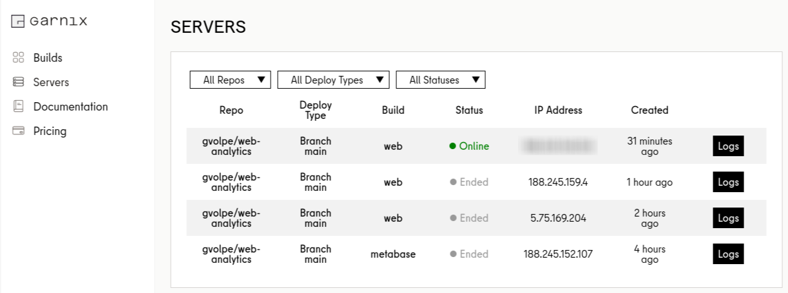

## Introduction

The folks at [Garnix](https://garnix.io) have done it again! You can now deploy a [NixOS server](https://nixos.org/) in minutes, just by defining your system on a `flake.nix` and `git push`'ing your changes (Garnix needs to be enabled for the repo).

In their latest blog post [Hands-on NixOS servers](https://garnix.io/blog/hosting-nixos), they explain all the necessary steps to deploy your own server, so I won't repeat things over. Furthermore, there's [official documentation](https://garnix.io/docs/hosting).

Instead, I will explain how I used this opportunity to set up a web analytics server for this blog.

## Web Analytics

I first looked into the different open-source solutions that allow self-hosting, and ended up choosing [Plausible](https://plausible.io/), briefly defined as follows:


"Plausible is intuitive, lightweight and open source web analytics. No cookies and fully compliant with GDPR, CCPA and PECR. Made and hosted in the EU, powered by European-owned cloud infrastructure 🇪🇺"


You can find the source code for the self-hosting community edition [here](https://github.com/plausible/community-edition/).

So, how do we set it up to run as a service with NixOS? Here are the relevant pieces:

```nix
let
  host = "analytics.gvolpe.com";
  internalPort = 8000;
in
{
  imports = [ ./agenix.nix ];

  services.plausible = {
    enable = true;
    adminUser = {
      name = "admin";
      email = "admin@garnix.io";
      activate = true;
      passwordFile = "/run/agenix/admin";
    };
    server = {
      baseUrl = "https://${host}";
      port = internalPort;
      secretKeybaseFile = "/run/agenix/keybase";
    };
  };

  services.nginx = {
    enable = true;
    virtualHosts."${host}" = {
      locations."/".proxyPass = "http://localhost:${toString internalPort}";
    };
  };
}
```

This configuration is written to `hosts/default.nix`. The Plausible server runs on `localhost:8000`, which is proxied via [nginx](https://nginx.org/en/) to ports 80 and 443 (the latter handled directly by Garnix).

```nix
{
  networking.firewall.allowedTCPPorts = [ 80 443 ];
}
```

It also uses a [PostgreSQL](https://www.postgresql.org/) instance [auto-magically set up by its NixOS module](https://github.com/NixOS/nixpkgs/blob/345c263f2f53a3710abe117f28a5cb86d0ba4059/nixos/modules/services/web-apps/plausible.nix#L308) --- gotta love NixOS! 🤩

Moreover, note that I used a [custom domain](https://garnix.io/docs/hosting/custom-domain), but this is not a requirement. You can get started by setting it to a value that adheres to the following format:

```bash
<HOST>.<BRANCH>.<REPONAME>.<GITHUB ORG/USER>.garnix.me
```

So, for this example in particular, it would be as follows:

```nix
host = "web.main.web-analytics.gvolpe.garnix.me";
```

### Secrets

The Plausible service requires two secrets: the admin user's password, and the keybase secret. To set them up safely, we use [agenix](https://github.com/ryantm/agenix), as documented in the [Garnix docs](https://garnix.io/docs/hosting/secrets) --- though, keep in mind its caveats!

Here's the `agenix.nix` file imported in the previous code snippet:

```nix
{ ... }:

{
  age = {
    secrets = {
      admin.file = ../secrets/admin.age;
      keybase.file = ../secrets/keybase.age;
    };
    identityPaths = [
      "/var/garnix/keys/repo-key"
    ];
  };
}
```

This requires the agenix NixOS module to be imported first:

```nix
{
  nixosConfigurations.web = nixpkgs.lib.nixosSystem {
    modules = [
      garnix-lib.nixosModules.garnix
      agenix.nixosModules.default
      ./hosts
    ];
  };
}
```

Also note that every secret needs to be manually set up via `agenix` (see documentation), resulting in two encrypted files that can only be decrypted with the supplied SSH keys.

### Garnix configuration

We can opt for [continuous deployment](https://garnix.io/docs/hosting/branch), so that our server is re-deployed on every commit to the main branch. Here's what we need to set in our `garnix.yaml` file:

```yaml
servers:
  - configuration: web
    deployment:
      type: on-branch
      branch: main
```

The configuration name `web` corresponds to the exposed NixOS configuration:

```bash
$ nix flake show
git+file:///home/gvolpe/workspace/web-analytics
├───nixosConfigurations
│   └───web: NixOS configuration
└───packages
    └───x86_64-linux
        └───default: package 'agenix-0.15.0'
```

And of course, we could deploy on every [pull request](https://garnix.io/docs/hosting/pr) too!

### See it live!

Sure enough, after a few hours of traffic, we can already see active metrics:


You can see it [live here](https://analytics.gvolpe.com/gvolpe.com) --- these analytics are publicly available.

NOTE: By default, signing up via the web is disabled; the only way to access it is with the "admin" user.

## Persistence

Let's now discuss a crucial aspect of server deployments: *state*.

I tried a few deployments until I got the service up and running, and by default, a new server with unique IP address would be provisioned on every commit to the configured branch, as we can see in the list of servers below (it can be accessed via your [Garnix account](https://garnix.io/servers)):



This is great for zero-downtime deployments, but Plausible persists its data in PostgreSQL, so we need that data to still be available on new deployments.

Fortunately, Garnix [supports persistence](https://garnix.io/docs/hosting/persistence) via the following NixOS configuration:

```nix
{
  garnix.server.persistence = {
    enable = true;
    name = "plausible";
  };
}
```

As long as the `name` remains the same, Garnix will deploy new commits to the same machine (same IP address). This is great for quick solutions, but for anything serious, please consider backing up your data.

I might give [Borg](https://www.borgbackup.org/) a try soon enough, as it's [already packaged](https://search.nixos.org/options?channel=unstable&from=0&size=50&sort=relevance&type=packages&query=services.borgbackup) for Nix :)

## Machine

It is worth mentioning a few things about the **FREE machine** we get by default on the free account, which you can connect to via SSH with its assigned IP address.


We're obviously running NixOS! Furthermore, we have an Intel Xeon CPU with two cores and 4Gb of RAM, which I find very generous already, but what stands out the most to me is the free 40Gb of disk space!


Here we can observe a few services like Clickhouse and Postgres up and running, among other metrics.

## Final words

If you have followed my blog for a while, it shouldn't come as a surprise to see Garnix featured [once again](../categories/#garnix); they keep on delivering great features!

I think of this one as **hosting and continuous deployment made simple™️**. Nevertheless, bear in mind that this feature is currently in beta, so please report any issues you may find.

Have you tried Garnix yet? If not, what are you waiting for? 😉

**DISCLAIMER**: I am not affiliated to Garnix; this is an independent review.

Best,
Gabriel.

---

### Addendum

Well, apparently someone shared this blog-post on [Hacker News](https://news.ycombinator.com/item?id=41558865) and the metrics have blown up, so this was actually a great test for the Plausible server, thank you all! 🙏


