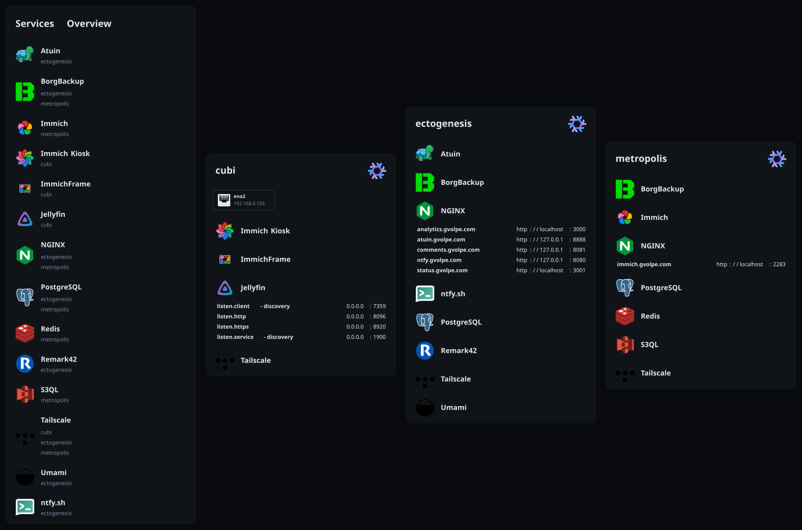
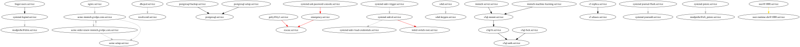



The System and Service Manager [systemd](https://systemd.io/) provides the building blocks for Linux systems, and it's the default in NixOS --- though, there are a few alternatives such as [finix](https://github.com/finix-community/finix) and [sixos](https://codeberg.org/amjoseph/sixos) that currently explore this design space.

As someone currently self-hosting a few services on my NixOS servers, it's almost a daily command by now.


*Current status of my servers, as generated by [nix-topology](https://oddlama.github.io/nix-topology/) ❄️*

I had to add a few custom icons and patches to the renderer to get the result I wanted, but it's a fantastic tool overall.

## Runtime Schedule

Recently, I've been doing some upgrades and maintenance in one of my servers running [Immich](../immich-photos), and I thought I would check the current job schedule to ensure they are configured correctly in my timezone.

```console
[admin@metropolis:~]$ systemctl list-timers --all
NEXT                              LEFT LAST                             PASSED UNIT                                 ACTIVATES
Sat 2026-08-15 10:44:47 CEST     15min Sat 2026-08-15 10:14:47 CEST  14min ago disk-monitor.timer                   disk-monitor.service
Sat 2026-08-15 11:00:00 CEST     30min Sat 2026-08-15 10:00:08 CEST  29min ago logrotate.timer                      logrotate.service
Sat 2026-08-15 15:21:37 CEST  4h 52min Fri 2026-08-14 15:21:40 CEST    19h ago acme-renew-immich.gvolpe.com.timer   acme-order-renew-immich.gvolpe.com.service
Sat 2026-08-15 22:52:43 CEST       12h Fri 2026-08-14 22:52:43 CEST    11h ago systemd-tmpfiles-clean.timer         systemd-tmpfiles-clean.service
Sun 2026-08-16 00:00:00 CEST       13h Sat 2026-08-15 00:00:08 CEST    10h ago custom-immich-stop-trigger.timer     custom-immich-stop-trigger.service
Sun 2026-08-16 00:00:01 CEST       13h Sat 2026-08-15 00:00:08 CEST    10h ago postgresql-backup.timer              postgresql-backup.service
Sun 2026-08-16 00:00:05 CEST       13h Sat 2026-08-15 00:00:08 CEST    10h ago borgbackup-job-immich-s3-media.timer borgbackup-job-immich-s3-media.service
Sun 2026-08-16 00:00:05 CEST       13h Sat 2026-08-15 00:00:08 CEST    10h ago borgbackup-job-postgres.timer        borgbackup-job-postgres.service
Sun 2026-08-16 00:00:30 CEST       13h Sat 2026-08-15 00:00:35 CEST    10h ago s3-replica.timer                     s3-replica.service
Sun 2026-08-16 03:00:00 CEST       16h Sat 2026-08-15 03:00:08 CEST     7h ago s3ql-fsck.timer                      s3ql-fsck.service
Sun 2026-08-16 03:30:00 CEST       17h Sat 2026-08-15 03:30:06 CEST     6h ago custom-immich-start-trigger.timer    custom-immich-start-trigger.service
Mon 2026-08-17 00:00:00 CEST 1 day 13h Mon 2026-08-10 02:00:08 CEST 5 days ago nix-gc.timer                         nix-gc.service
Mon 2026-08-17 01:39:34 CEST 1 day 15h Mon 2026-08-10 02:52:22 CEST 5 days ago fstrim.timer                         fstrim.service

13 timers listed.
```

*As the number of jobs grows, it's easy to lose track.*

However, looking at this information has got me wondering whether it was possible to get this information directly from my NixOS configuration instead of having to deploy before checking --- i.e. build-time checks instead of runtime checks.

## Build-Time Schedule

A nice property of NixOS is that it produces a derivation at build time, which is a build recipe of the entire system that can be easily inspected; and the systemd configuration that's part of it is no exception.

```console
nix-repl> nixosConfigurations.metropolis.config.systemd.timers
{
  "acme-renew-immich.gvolpe.com" = { ... };
  borgbackup-job-immich-s3-media = { ... };
  borgbackup-job-postgres = { ... };
  custom-immich-start-trigger = { ... };
  custom-immich-stop-trigger = { ... };
  disk-monitor = { ... };
  fstrim = { ... };
  logrotate = { ... };
  nix-gc = { ... };
  postgresql-backup = { ... };
  s3-replica = { ... };
  s3ql-fsck = { ... };
}

nix-repl> nixosConfigurations.metropolis.config.systemd.timers.s3-replica.timerConfig
{
  OnCalendar = "*-*-* 0:00:30";
  Persistent = false;
}
```

So the information is available and we can process it however we see fit. In my case, I wanted to create a Mermaid flow diagram with each server's schedule, and here's the result (see it on [Mermaid Live](https://mermaid.live/edit#pako:eNqtlVtu2zgUhrdCMCh6geXoakua1EDdGH1rHprBAAO_0BQtc0yKGpJK4gRZy8wOurUuoRSlKLLj2GkR2TBE-vzU9x8eHd5BLDICU_jmDfhCCiKRJhlYSsEBuUKsssOv9ObiG1AbpQnPgKacSDWcF0smrvEKSQ0uz-cFMH9oRt7N4WUdABRekaxiBCyFPFvI0wk4W0w40VKUglF1drqYNNPvZpWZI6d_IanQ9fs5fF8vhhlS6pwsm1XBkjKWniSzaTIbDZRZZE3Sk6W9BlgwIdMTz1472pqk0U7jmTudvly7EEK30s9JLX65tCSSioziVj4bTUefvJfJW7v2t568dE1CTeI-OOYDXDe13y55uFJacIdyTvHKMfeloyXNcyKH1rsNOitN8OTHf_9_t7rTcgIO6BSRVxST_jYYiiaV3S4Dx5mYWUvobRFaQK8DLIXSuSTqX-YsEF5X5WGup-F7cbxHHINmWWwKL_2nLFHHshAyb1Z1_hGLznzgcJJRdBjsiLalbNVA6Q0jH982W5xLtPnj7cQUhaLmDSpMVSGmSL3stiu_58prXPl2EPyCq4cM_pKdTvQqPoKeD7_xEdhB-MRH8FjKJpeSlIziIzvRi3sV2rBHGzS0oR1EW7TBzpunAlOjS4XXx2gfwl4FNurBhg1sZAejHdjgYJswPfv3-kRfuPfNHPUAowZwZAfjBvCimJq--o3gjxEfgIviz4LqT1jTK1LPBS7vmDOq1g4X5n9xBHIrci_V2Hbzne41tlxxw5UhyjbdsxHmxFRZQa5b68P8SrCSDLHgh1msUsiMyGf1LygEiYpMcHprzt6MMLQBfrhq2uljhWyIelofcXf27JiNrdmkMbsSley5ZSKXQpuT_rC1x7C9OU6ee3TSNLT2ILsmZN179tKcivRITtuYrbytzE9Bb5wcH9a2Mb-Tc3c341pWe15Jz33OuGfORziAuaQZTGvxABpSjuohvKuD51CvCDeJTM1thuR6DufFvdGUqPhbCP4gk6LKVzC1TWEAqzIzu3BOkSHn3awpN1N1n0VVaJiOI7sGTO_gDUz9MBkmrhuEXhj5sZcEowHcwNSJ46HnReMwdt1k7Id-cD-At_ax3tB3_XHsB1EYJ7Efef79T2O6XiQ)).



This was hacked-up together with a Python script that fetches the core information with the following command:

```console
nix eval --json .#nixosConfigurations.metropolis.config.systemd.timers \
         --apply 'builtins.mapAttrs (name: timer: timer.timerConfig)' | jq
```

Which produces the following JSON data:

```json
{
  "acme-renew-immich.gvolpe.com": {
    "AccuracySec": "86400s",
    "FixedRandomDelay": true,
    "OnCalendar": "daily",
    "Persistent": "yes",
    "RandomizedDelaySec": "24h",
    "Unit": "acme-order-renew-immich.gvolpe.com.service"
  },
  "borgbackup-job-immich-s3-media": {
    "OnCalendar": "*-*-* 0:00:05",
    "Persistent": false
  },
  "borgbackup-job-postgres": {
    "OnCalendar": "*-*-* 0:00:05",
    "Persistent": false
  },
  "custom-immich-start-trigger": {
    "OnCalendar": "*-*-* 03:30:00",
    "Unit": "custom-immich-start-trigger.service"
  },
  "custom-immich-stop-trigger": {
    "OnCalendar": "*-*-* 00:00:00",
    "Unit": "custom-immich-stop-trigger.service"
  },
  "disk-monitor": {
    "OnBootSec": "5m",
    "OnUnitActiveSec": "30m"
  },
  "fstrim": {
    "OnCalendar": [
      "",
      "weekly"
    ]
  },
  "logrotate": {
    "OnCalendar": [
      "hourly"
    ]
  },
  "nix-gc": {
    "OnCalendar": [
      "weekly"
    ],
    "Persistent": true,
    "RandomizedDelaySec": "0"
  },
  "postgresql-backup": {
    "OnCalendar": "*-*-* 0:00:01",
    "Unit": "postgresql-backup.service"
  },
  "s3-replica": {
    "OnCalendar": "*-*-* 0:00:30",
    "Persistent": false
  },
  "s3ql-fsck": {
    "OnCalendar": "*-*-* 03:00:00",
    "Persistent": false,
    "Unit": "s3ql-fsck.service"
  }
}
```

Then it's all about processing this data to generate the Mermaid diagram in the desired format.

### Timezone

The script follows this order of evaluation, and it defaults to UTC if both values are absent.

```console
nix-repl> nixosConfigurations.metropolis.config.systemd.globalEnvironment.TZ
"Europe/Warsaw"

nix-repl> nixosConfigurations.metropolis.config.time.timeZone
"Europe/Warsaw"
```

Multiple timezones can be set individually on each service unit, but this is not a feature I need right now.

## Runtime Dependencies

On a running server, we can generate a diagram of systemd dependencies with the following command:

```console
systemd-analyze dot --require --from-pattern="*.service" --to-pattern="*.service" \
  | dot -Tsvg > services.svg
```

Which renders something like this for this NixOS server:



That can quickly get pretty unreadable, so in general it's more useful to analyze specific units and not all of them, e.g.

```console
[admin@metropolis:~]$ systemctl show immich-server.service -p Requires -p Wants
Requires=postgresql.target s3ql-mount.service -.mount system-immich.slice
Wants=-.mount
```

These tools are useful for our daily server maintenance tasks, but can we verify dependencies without actually deploying first?

## Build-Time Dependencies

It is no surprise that this information is available in our NixOS configuration blueprint as well.

```console
nix-repl> nixosConfigurations.metropolis.config.systemd.services.s3 <TAB>
nixosConfigurations.metropolis.config.systemd.services.s3-aliases
nixosConfigurations.metropolis.config.systemd.services.s3-replica
nixosConfigurations.metropolis.config.systemd.services.s3ql-auth
nixosConfigurations.metropolis.config.systemd.services.s3ql-fs
nixosConfigurations.metropolis.config.systemd.services.s3ql-fsck
nixosConfigurations.metropolis.config.systemd.services.s3ql-mount
```

The following one-liner command shows how to get all systemd dependencies directly from our NixOS configuration:

```console
nix eval --json .#nixosConfigurations.metropolis.config.systemd.services \
         --apply 'builtins.mapAttrs (name: service: { inherit (service) requires wants wantedBy requiredBy; })' \
         | jq 'with_entries(.value |= with_entries(select(.value != []))) | with_entries(select(.value != {}))'
```

To keep it brief, here's part of the JSON data that's produced by it:

```json
{
  "immich-machine-learning": {
    "requires": [
      "postgresql.target",
      "s3ql-mount.service"
    ],
    "wantedBy": [
      "multi-user.target"
    ]
  },
  "immich-server": {
    "requires": [
      "postgresql.target",
      "s3ql-mount.service"
    ],
    "wantedBy": [
      "multi-user.target"
    ]
  },
  "nginx": {
    "wantedBy": [
      "multi-user.target"
    ],
    "wants": [
      "acme-immich.gvolpe.com.service"
    ]
  }
}
```

I didn't create any diagrams out of this, but we have the necessary data if that's something we want to do.

## Final thoughts

I thought this was worth sharing, as NixOS doesn't cease to amaze me 🤩. Safe to say I'm always learning new things, and more importantly, having tons of fun running these servers! Can't recommend it enough.

What do you think? Let me know in the comments below 👇

Best,
Gabriel.
