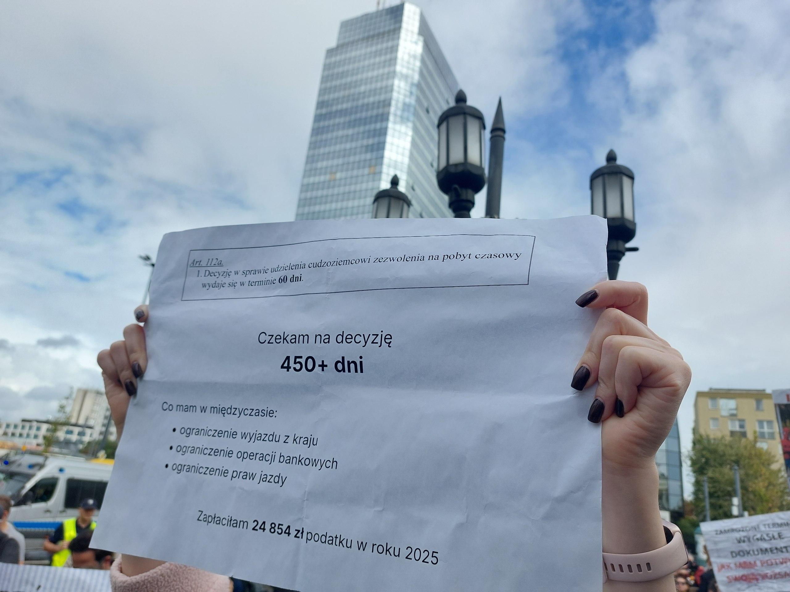
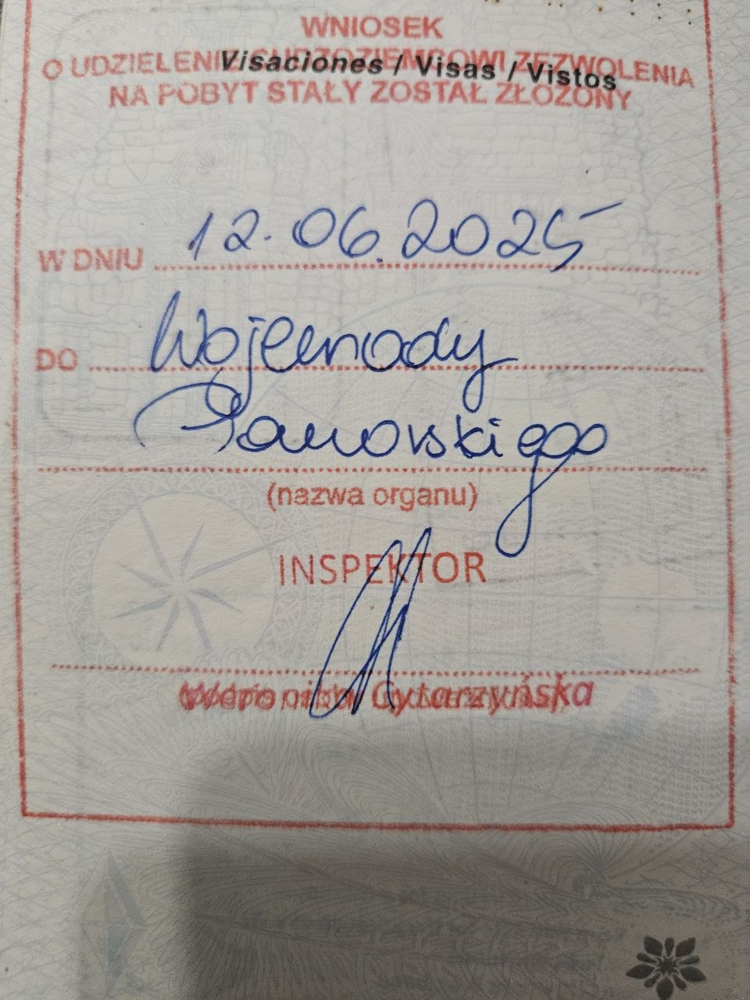

Today is my birthday, but I'm not in the mood to celebrate. Today marks **131 days** since my legal status in Poland has basically become *tax-paying prisoner*, which was the day my second temporary residency card has expired (April 16, 2026).

Today is **Day 439** since my residency application was submitted on June 12, 2025. The Polish law says it shouldn't take more than *60 days*.


"Permanent residence? For now, the only permanent is wait."


During this period, we're left in the limbo, unable to travel for business or family urgencies. Need to make it to a funeral? Attend your brother's wedding? Forget about it, you're not allowed to leave the country without losing years of progress on your residency status.

The same happened with my two previous temporary residency permits. The first one took 18 months and it was issued just for 1 year (11 months in practice since they take an extra month to produce the physical card 🤦‍♂). The second one took "only" 9 months with a good lawyer.

Yesterday, a [protest](https://glos-migranta.eu/) has been held in Warsaw on the [matter](https://nowinywschodnie.pl/placimy-podatki-czekamy-latami-protest-cudzoziemcow-w-warszawie/). Wish I could have joined.

Government officials are bluntly (and in many cases *unconstitutionally*) violating a few laws clearly outlined in [this article](https://warsawpoint.com/politics/92285-the-394-day-prison-how-a-residence-card-holders-life-is-suspended-by-official-delay.html).

My lawyer has submitted a formal inaction complaint (*"ponaglenie"*), which has been ignored by the [Department for Foreigners' Affairs](https://wsc.gdansk.uw.gov.pl/en) (or *Pomorski Urząd Wojewódzki w Gdańsku*) as it has become the norm. We have now submitted a complaint for inaction with the administrative court (*"Skarga do WSA na bezczynność"*) and are awaiting a response, but it may not be enough.

## Background Story

My Polish wife and I moved here from Japan 🇯🇵 during the pandemic madness in early 2020, so she could stay close to her grandparents that were at the time in a very delicate state of health. They have passed away during this time, but we remained in the country so she could take care of her mother as the single daughter she is.

Ever since, we have built a peaceful life here; adopted two cats ([adopt, don't shop](https://www.caninejournal.com/adopt-dont-shop/)) and have simply been two *law-abiding citizens*, much like the estimated [1.51 million Polish citizens](https://biznes.interia.pl/gospodarka/news-gus-ujawnil-nowe-dane-o-emigracji-coraz-mniej-polakow-wyjezd,nId,23527904) that lived abroad during 2025.

Though, my connection with Poland has existed before even moving here. I gave [conference talks](../../tags/poland/) and even learned some Polish words circa 2015/16 when I lived in Ireland 🇮🇪. I remember meeting a few Poles that taught me what they don't teach you in school *#iykyk* 😅

In hindsight, I wish I had done my Italian 🇮🇹 citizenship when I had the chance before the [law was changed](https://italylawfirms.com/en/the-jus-sanguinis-2025-reform-italian-citizenship-law/) in March 2025 (talk about luck), but the process wasn't any less bureaucratic so... My father's family were immigrants from [Foggia, Italy](https://maps.app.goo.gl/oLYoz562AekZhMH87) that have fled the war by ship to Argentina 🇦🇷 in search of a better life. My last name "Volpe" means "fox" 🦊 in Italian 🤌.

## Tax Contributions

During my time here, I have built a business and have *positively contributed* to the local economy, though the playground isn't fair game.


"The State wants taxes on time. We want decisions on time."


To give you an idea, here's the amount of money I have paid in Personal Income Taxes (PIT) during last year in Poland:

- **2025**: *121.794,84 zł*

I have totalled nearly *a million złoty* (*~271k USD*) in PIT contributions, including 2026, but I cannot carry on like this.

## Blocked Bank Accounts

Tax obligations come after us, but it's becoming a mission impossible to remain compliant.


"No card. Account blocked. Taxes still payable."


[Wise](https://wise.com/) has suspended my bank account yesterday. [Revolut](https://www.revolut.com/) has given me an ultimatum. [Pekao](https://www.pekao.com.pl/) (local bank) is threatening to close my bank account. All because *they require me to present valid proof of residency which I don't have*.

How am I supposed to pay taxes when I'm unable to have a bank account? 🤷‍♂ **To naprawdę nie ma sensu**.

This is an incredibly *frustrating and stressful* situation. I don't wish anyone go through this hell.


"The office waits. The bank doesn't."


All I have is a stamp on my passport that is not accepted by any banks that are regulated by EU laws.

The average processing times for residency applications is now of *2+ years* and that is a very long time.

## Mental Health

This whole situation has certainly taken a toll on my mental health, and many times I have considered just throwing in the towel, but I've being through worse times and I know I'm capable of getting through this as well. I won't just give up, though the damage has already been done.

*My life has been literally put on pause*, all while having to maintain my legal obligations. This is cruel and inhumane.

Ever since I was born, my life was a constant battle uphill having been raised by a poor family in a humble Argentine neighborhood. It always felt like the Sisyphus story from Greek mythology, and even though I'm used to fight for my rights, it really is exhausting.

## Final Thoughts

Poland is a wonderful country with fantastic people. My wife and I would love to remain here to continue building our future together, so we're hoping things improve for the thousands of *legal immigrants* currently affected.

Though, even if we end up moving elsewhere where we're treated more fairly, I would never forget its people and the many long-lasting and meaningful relationships we have built around here. *Niech żyje Polska!* 🇵🇱

If you've made it until here, I ask you to share this with as many as possible🙏, perhaps some leaders are listening. To those who had come here for my tech content, I promise that will resume soon, but I needed to get this out of my chest before my head implodes 🤯.

The ask is fairly simple: **Government officials to respect and follow the Polish law!**

And to the internet trolls spewing out xenophobic comments, I love you all 😘 (*#MakeLoveNotWar*)

Peace out ✌,
Gabriel.
